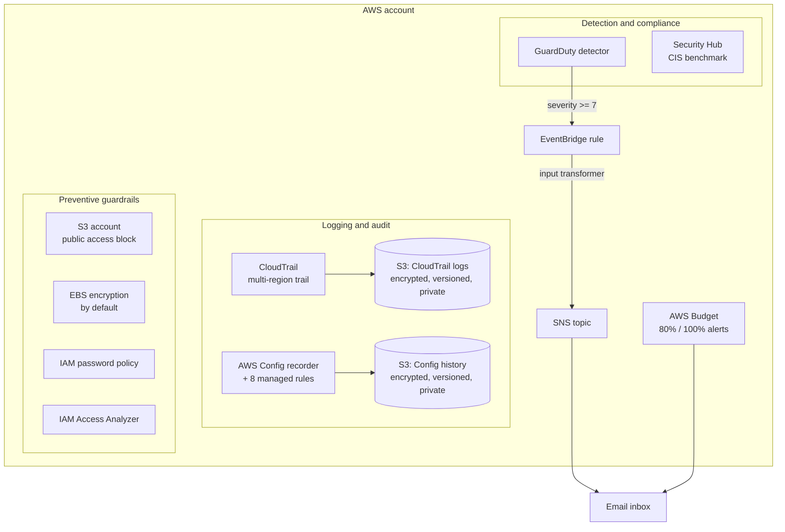

# aws-security-baseline

Terraform that turns a fresh AWS account into a securely configured one in a single apply: audit logging, threat detection, compliance checks, preventive guardrails, and cost alerts.

## Why I built this

After six years in systems administration, the first thing I do with any new server is harden it before it does real work, and a new AWS account deserves exactly the same treatment. Most personal and small-business accounts run for years with no CloudTrail, no MFA checks, and no billing alarms, because nobody made hardening a repeatable step. This repo is that step: one `terraform apply` that gives an account the security floor I would want in place before deploying anything else.

## What this demonstrates

- Cloud security engineering on AWS: CloudTrail, GuardDuty, AWS Config, Security Hub, IAM Access Analyzer, and account-level guardrails configured together as one coherent baseline
- Mapping technical controls to a recognised framework (CIS AWS Foundations Benchmark) rather than enabling services at random
- S3 hardening as a habit: encryption, versioning, public access blocks, TLS-only bucket policies, and lifecycle-based retention on every bucket
- Event-driven alerting: EventBridge pattern matching with numeric severity filters and an input transformer that produces readable emails instead of raw JSON
- Least-privilege IAM: service roles scoped to a single bucket prefix, service principals pinned with `aws:SourceArn` / `aws:SourceAccount` conditions against confused-deputy access
- Clean Terraform: one file per concern, no hardcoded account IDs or partitions (data sources everywhere), variables with validation, tagged resources via `default_tags`
- Cost awareness: knowing what each security service costs and building the budget alarm into the same baseline

## Architecture



Three layers work together. The logging layer (CloudTrail, AWS Config) creates the tamper-evident record of what happened and what changed. The detection layer (GuardDuty, Security Hub, the Config rules) continuously evaluates that record and the account's live state against threats and the CIS benchmark. The guardrail layer (account-wide S3 public access block, EBS default encryption, the password policy) prevents whole classes of mistakes from being possible at all. High-severity GuardDuty findings and budget overruns both land in the same email inbox, so there is exactly one place to watch.

## Repository layout

```
aws-security-baseline/
├── versions.tf                Terraform and AWS provider version constraints
├── providers.tf               Provider config, default tags, identity data sources
├── variables.tf               All inputs, each described and validated
├── outputs.tf                 Trail ARN, detector ID, topic ARN, and friends
├── cloudtrail.tf              Multi-region trail + hardened log bucket
├── guardduty.tf               GuardDuty detector
├── alerting.tf                SNS topic, email subscription, EventBridge rule
├── config.tf                  Config recorder, delivery bucket, 8 managed rules
├── security-hub.tf            Security Hub + CIS benchmark subscription
├── iam.tf                     Password policy + IAM Access Analyzer
├── s3-account.tf              Account-level S3 public access block
├── ebs.tf                     EBS encryption-by-default
├── budget.tf                  Monthly cost budget with email alerts
├── terraform.tfvars.example   Copy to terraform.tfvars and edit
├── LICENSE                    MIT
└── .gitignore
```

## Control-to-CIS mapping

Each control maps to an area of the CIS AWS Foundations Benchmark (the same benchmark Security Hub evaluates automatically once this is deployed):

| Control in this repo | CIS benchmark area |
| --- | --- |
| IAM account password policy (14+ chars, complexity, reuse prevention, max age) | Identity and Access Management |
| Config rules `root-account-mfa-enabled`, `iam-user-mfa-enabled` | Identity and Access Management |
| IAM Access Analyzer (account scope) | Identity and Access Management |
| Account-level S3 public access block (plus per-bucket blocks) | Storage |
| EBS encryption by default | Storage |
| Config rules `s3-bucket-public-read-prohibited`, `s3-bucket-public-write-prohibited`, `encrypted-volumes`, `rds-storage-encrypted` | Storage |
| Multi-region CloudTrail with log file validation | Logging |
| CloudTrail bucket hardening (encryption, versioning, no public access, TLS-only) | Logging |
| AWS Config recorder for all supported resource types, including global | Logging |
| Config rule `cloud-trail-enabled` | Logging |
| GuardDuty detector + EventBridge alerting to SNS | Monitoring |
| Security Hub with the CIS standard subscribed | Monitoring (automates checks across the whole benchmark) |
| Config rule `restricted-ssh` | Networking |
| Monthly AWS Budget with 80% actual / 100% forecast alerts | Not a CIS control, cost guardrail for a personal account |

## Prerequisites

- An AWS account, ideally fresh. AWS Config allows only one configuration recorder per region, and Security Hub can only be enabled once, so if these are already active you will need to import them or expect apply errors.
- An IAM identity with administrator access (this project configures account-level settings).
- Terraform >= 1.5 (`terraform version`).
- AWS CLI configured (`aws configure` or environment variables), Terraform uses the same credential chain.

## Deployment

1. Clone the repository:

   ```bash
   git clone https://github.com/aminafara123/aws-security-baseline.git
   cd aws-security-baseline
   ```

2. Create your variables file and set your alert email (the only required value):

   ```bash
   cp terraform.tfvars.example terraform.tfvars
   # edit terraform.tfvars: alert_email = "you@example.com"
   ```

   The region is variable-driven. `us-east-1` is the default for service availability and free-tier friendliness, but every service used here is also available in `me-central-1` (UAE) if you prefer to deploy there.

3. Initialise, review, and apply:

   ```bash
   terraform init
   terraform plan
   terraform apply
   ```

4. Confirm the SNS subscription: AWS sends a "Subscription Confirmation" email to your alert address. Click the link once, or GuardDuty alerts will not be delivered.

5. Verify the alerting pipeline end to end by generating sample findings:

   ```bash
   aws guardduty create-sample-findings \
     --detector-id "$(terraform output -raw guardduty_detector_id)" \
     --finding-types "Backdoor:EC2/C&CActivity.B!DNS"
   ```

   Within about fifteen minutes you should receive a formatted email describing the sample finding.

## Cost

Roughly free for 30 days, then a few dollars a month on a small personal account. The three services that matter:

| Service | Cost profile |
| --- | --- |
| GuardDuty | 30-day free trial, then typically $1–5/mo on an idle personal account (priced on events and data analysed) |
| Security Hub | 30-day free trial, then typically $1–3/mo (priced per security check and finding ingestion) |
| AWS Config | No free trial, bills from day one: per configuration item recorded (~$0.003 each) and per rule evaluation (~$0.001 each); a quiet account usually lands at $1–3/mo, with small spikes when many resources are created or destroyed |
| CloudTrail | First copy of management events is free; the S3 storage is pennies at personal-account volume |
| S3 (two log buckets) | A few cents/mo; the lifecycle rule expires objects after `log_retention_days` (default 365) so storage never grows unbounded |
| SNS, EventBridge | Effectively free at this volume (email notifications have a generous free tier) |
| Budgets, Access Analyzer, password policy, S3 account block, EBS default encryption | Free (cost budgets without actions are free; account-scope Access Analyzer is free) |

AWS Config is the one to watch: because it charges per configuration item, a busy account (lots of resource churn) costs more than an idle one. The included budget (default $10/mo) emails you at 80% actual and 100% forecasted spend, so cost drift is caught by the same baseline.

### Teardown

```bash
terraform destroy
```

Type `yes` when prompted. Notes:

- The log buckets are created with `force_destroy = true`, so `terraform destroy` deletes them even though CloudTrail and Config have written objects into them. No manual emptying needed.
- Destroy disables GuardDuty, Security Hub, and Config in that region; findings and recorded history are discarded.
- If you confirmed the SNS email subscription, it is removed with the topic.

## Design decisions

- **SSE-S3 (AES256) instead of a KMS CMK for the log buckets.** A customer-managed key adds $1/mo per key plus per-request charges and key-policy complexity. For a personal baseline, SSE-S3 gives encryption at rest with zero cost; the roadmap below covers the CMK upgrade.
- **`enable_default_standards = false` on Security Hub, then an explicit CIS subscription.** Letting Security Hub auto-enable standards means the account's state silently diverges from the code. Opting in explicitly keeps Terraform the single source of truth for what is being checked.
- **EventBridge input transformer instead of raw finding JSON.** An alert you cannot read on a phone at 3 a.m. is an alert that gets ignored. The transformer extracts severity, type, description, and finding ID into a short plain-text email.
- **A custom IAM role for Config, scoped to one bucket prefix.** The role combines the AWS-managed `AWS_ConfigRole` read policy with an inline policy that can write only to `AWSLogs/<account-id>/Config/*` in the dedicated bucket, least privilege, and the same confused-deputy protection (`aws:SourceArn` / `aws:SourceAccount` conditions) used on the CloudTrail bucket policy.
- **Severity threshold 7 (High) for alert emails, variable-driven.** GuardDuty produces plenty of low and medium findings; emailing all of them trains you to delete alerts. High and Critical findings go to email; everything else is reviewed in the console.
- **`force_destroy = true` on log buckets.** Deliberately demo-friendly: teardown works in one command. In production this is the first thing I would remove, audit logs should require intent (and ideally MFA delete or Object Lock) to destroy.

## What I'd add next

- Organizations-level rollout: an organization trail, delegated administrator for GuardDuty and Security Hub, and Config conformance packs across all member accounts
- KMS customer-managed keys for CloudTrail, the log buckets, and the SNS topic, with key policies scoped to each service
- CloudTrail to CloudWatch Logs with metric filters and alarms for root usage, console logins without MFA, and IAM policy changes (the CIS Monitoring area's alarm controls)
- Multi-region coverage for the regional controls (Config, EBS default encryption, Access Analyzer) via provider aliases or a per-region module
- Auto-remediation: SSM Automation or Lambda triggered by Config rule violations (for example, stripping public ACLs the moment they appear)
- Remote state in S3 with DynamoDB locking, and a CI pipeline running `terraform fmt -check`, `tflint`, and `checkov` on every pull request

## Screenshots

After deploying, capture these and embed them here:

<!-- TODO: CloudTrail console, the trail showing Multi-region: Yes and Log file validation: Enabled -->
<!-- TODO: GuardDuty console, Settings page showing the detector enabled with its ID -->
<!-- TODO: Security Hub, CIS AWS Foundations Benchmark enabled, with the initial security score -->
<!-- TODO: AWS Config, Rules page showing all 8 managed rules and their compliance status -->
<!-- TODO: The formatted alert email received after running the create-sample-findings command -->
<!-- TODO: Budgets console, the monthly budget with both notification thresholds -->

## About me

> I'm Al Amin Bashir Afara, I spent seven years in IT (systems administration, infrastructure, and support) before completing a BSc in Computer Science, and I'm now focused on cloud security engineering on AWS. I'm open to remote cloud engineering and cloud security roles.
> GitHub: https://github.com/aminafara123 · LinkedIn: https://www.linkedin.com/in/aminafara · Email: aminafara123@gmail.com

## License

MIT, see [LICENSE](LICENSE).
